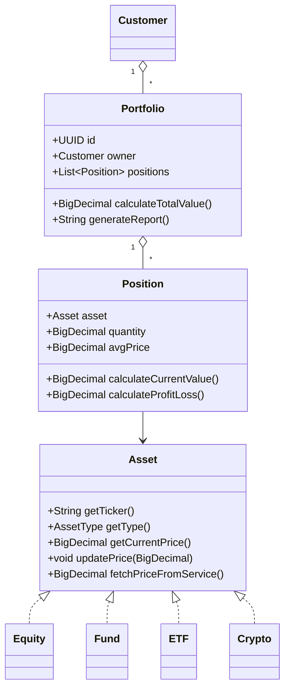

# Java Portfolio Tracker

Gerenciador de Carteira de Investimentos em Java, um projeto educacional para aplicar conceitos de **Programação Orientada a Objetos (POO)**, implementado sem Maven/Gradle. Inspirado no [Desafio POO DIO](https://github.com/cami-la/desafio-poo-dio/tree/master) e adaptado ao domínio financeiro.

---

## 🚀 Visão Geral

Este sistema permite cadastrar clientes, criar múltiplas carteiras de investimento e gerenciar posições em diferentes tipos de ativos (ações, fundos, ETFs e criptomoedas). Oferece cálculos de valor atualizado da carteira, lucro/prejuízo por posição e geração de relatórios em texto.

---

## 💡 Funcionalidades Implementadas

- **Cadastro de Cliente**: identificação por UUID, nome e e-mail.
- **Carteiras de Investimento**: cada cliente pode ter várias carteiras; CRUD básico (criar, listar, remover).
- **Ativos Financeiros**: interface `Asset` com implementações para `Equity`, `Fund`, `ETF` e `Crypto`.
- **Posições**: compra/venda parcial de ativos, cálculo de valor atual (`quantity × currentPrice`) e lucro/prejuízo (`(currentPrice - avgPrice) × quantity`).
- **PriceService**: abstração para atualização de cotações, com implementação `CsvPriceService` que lê preços de um arquivo CSV (mock).
- **Relatório de Carteira**: método `Portfolio.generateReport()` que imprime detalhes de cada posição.
- **Teste Básico na Main**: demonstra criação de cliente, carteira, adição de posições e exibição de resultados.

---

## 🛠 Tecnologias e Requisitos

- **Java 17+**
- **VS Code** (Editor de código)
- **Sem Maven/Gradle**: compilação e execução manual via `javac`/`java`
- (Opcional) **.vscode**: tarefas e configurações de depuração.

---

## 📁 Estrutura do Projeto

```bash
java-portfolio-tracker/
├── .gitignore          # Ignora bin/, .vscode/, arquivos gerados
├── .vscode/
│   ├── launch.json     # Configuração de debug
│   └── tasks.json      # Tarefa de build
├── lib/                # (opcional) dependências .jar
├── src/
│   └── com/mycompany/portfoliotracker/
│       ├── app/        # Main.java e classes de menu/CLI
│       ├── model/      # Portfolio, Position, Asset, Equity, Fund, ETF, Crypto, Customer, AssetType
│       └── service/    # PriceService, CsvPriceService
└── bin/                # Classes compiladas (.class)
```

---

## ▶️ Como Compilar e Executar

1. **Compilação**

   ```bash
   javac -d bin src/com/mycompany/portfoliotracker/app/*.java \
         src/com/mycompany/portfoliotracker/model/*.java \
         src/com/mycompany/portfoliotracker/service/*.java
   ```

2. **Execução**

   ```bash
   java -cp bin com.mycompany.portfoliotracker.app.Main
   ```

3. **Com .jar em lib/**

   ```bash
   javac -d bin -cp "lib/*" src/...
   java -cp "bin:lib/*" com.mycompany.portfoliotracker.app.Main
   ```

*(No Windows utilize `;` em vez de `:` no classpath.)*

---

## 📈 Diagrama de Classes (Mermaid)



O diagrama acima ilustra os principais elementos do domínio de investimentos e como eles se relacionam:

- **Customer**: representa o cliente, que pode possuir múltiplas carteiras (Portfolio).
- **Portfolio**: contém várias posições (Position) e oferece métodos para calcular o valor total e gerar relatórios.
- **Position**: associa um ativo (Asset) a uma quantidade e preço médio, permitindo calcular valor atual e lucro/prejuízo.
- **Asset**: interface abstrata que define comportamento comum (obtenção e atualização de preço), implementada por **Equity**, **Fund**, **ETF** e **Crypto**, demonstrando polimorfismo.

Este modelo enfatiza:
- **Encapsulamento**: cada classe gerencia seu próprio estado e expõe apenas o necessário.
- **Composição**: objetos maiores (Portfolio) são formados por objetos menores (Position).
- **Polimorfismo**: diferentes tipos de ativos podem ser tratados uniformemente via a interface Asset.

---

## 📄 License

Este projeto está licenciado sob a [MIT License](LICENSE).

---

## 🔗 Referências

- [Desafio POO DIO - cami-la](https://github.com/cami-la/desafio-poo-dio/tree/master)
- [Documentação Java (Oracle)](https://docs.oracle.com/en/java/)
